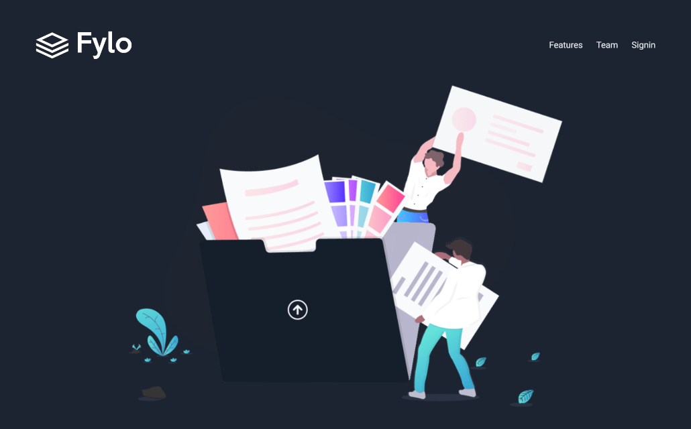
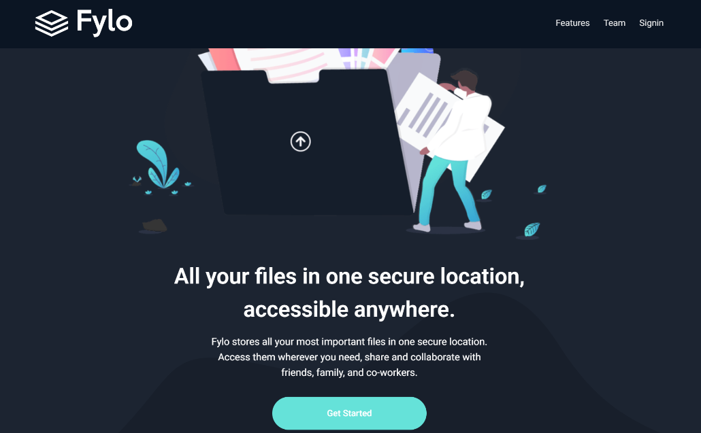
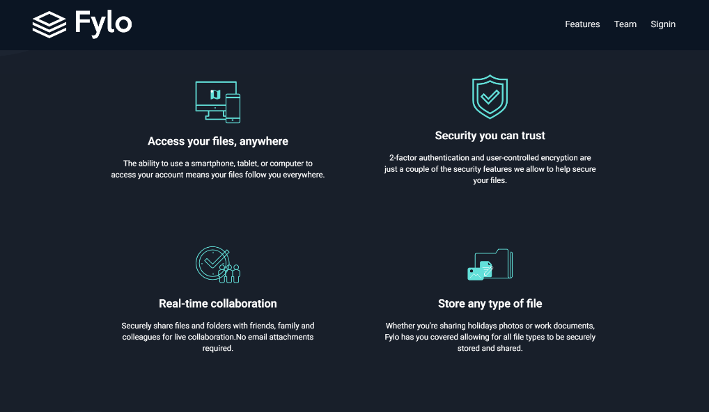

# Fylo Dark Theme – Frontend Mentor Challenge

## Description

Responsive landing page built as a **Frontend Mentor challenge** using **React**, **Vite**, and **Tailwind CSS**.

## Sections

Header, Landing, Features, Stay Productive, Testimonials, Get Started, Footer

## Technologies

React 19, Vite, Tailwind CSS v4, React Icons

## Images

Stored in `src/assets/images/`

|  |  |  |


|  |  |  |

## Run

```bash
npm install
npm run dev
```


